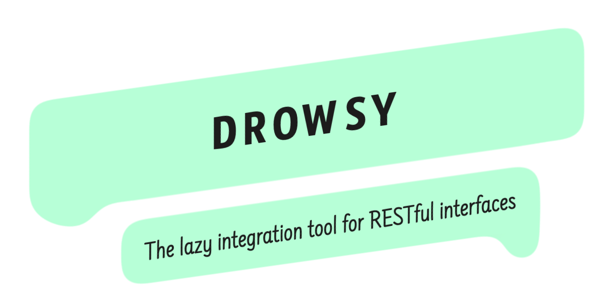

<p align="center">
  
</p>

<p align="center">
  <a href="https://www.npmjs.com/package/drowsy">
    
  </a>
  <a href="https://travis-ci.org/iainreid820/drowsy">
    
  </a>
  <a href="https://codecov.io/gh/iainreid820/drowsy">
    
  </a>
  <a href="https://lgtm.com/projects/g/iainreid820/drowsy">
    
  </a>
  <a href="#">
    
  </a>
</p>

Drowsy is a universal REST client that makes integrating with services so wonderfully simple, you'll probably forget
you're talking to an API after all. Think gRPC or SOAP, but for REST.

<p align="center">
  <a href="#description">
    
  </a>
  <a href="#examples">
    
  </a>
  <a href="#description">
    
  </a>
</p>

## Description

This is the perfect tool for any prototype project or proof-of-concept application needing to integrate quickly with
RESTful APIs, but it's also ideally suited as a convenience tool in larger projects that too rely on RESTful interfaces.
Gone are the days of defining an API client with a restricted set of methods, and gone too are the days of boilerplate
request handling in small and large code bases alike.

Drowsy just needs to know the hostname for the API you wish to consume, and off you go.

> Featured on [Changelog](https://changelog.com/news/drowsy-the-laziest-rest-client-youll-ever-see-wwn0)

## Examples

Below is a super simple example demonstrating how easy it can be to retrieve the first page of public Gists currently
available on GitHub.

```javascript
const github = drowsy(request, "https://api.github.com/");

github.getGists({
  headers: {
    "User-Agent": "Octo-app"
  }
});
```

By calling the method `getGists` you're infact performing a GET request to the endpoint "/gists" through the handler
provided (in this case, Request). The handler returns a Promise that will, hopefully, resolve in a timely fashion with
the first page of public Gists found on GitHub.

## License

This _awesome_ project is released under the [MIT License](./LICENSE). Enjoy responsibly ✌️
